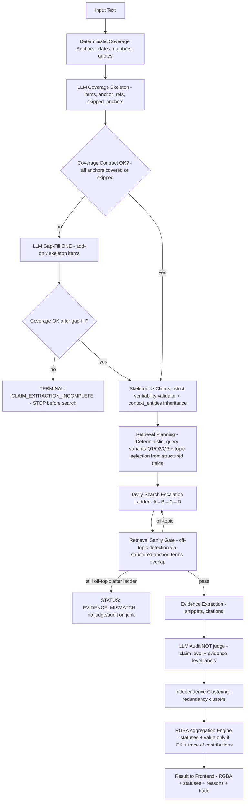

# Spectrue Constitution
## Contracts-first architecture invariants

This document defines non-negotiable invariants ("the Constitution") of the Spectrue verification pipeline.
Any PR must preserve these invariants. If an invariant is violated, the PR is invalid even if outputs "look better".

---

## Pipeline Overview

---

## I0. Single Source of Truth
**Invariant:** Core contracts and algorithms must have a single authoritative implementation and must be wired identically in all modes (normal/deep) and all pipeline variants (step-pipeline vs legacy orchestration).

**Forbidden:** Divergent behavior caused by duplicate implementations or mode-specific shortcuts.

---

## I1. No Empty Instructions
**Invariant:** Any LLM call used for critical steps (coverage skeleton, gap-fill, LLM audit) must not execute with empty instructions.

**Required behavior:**
- If instructions are empty, inject a default system instruction.
- Emit trace `claim_extraction.guard.missing_instructions`.

---

## I2. Coverage Anchors are Accounted For
**Invariant:** Every deterministic anchor extracted from the input text (time/number/quote) is either:
- referenced by at least one skeleton item via `anchor_refs`, or
- explicitly listed in `skipped_anchors` with a structural reason code.

**No silent drop.**

---

## I3. One Gap-Fill Attempt
**Invariant:** Coverage gap-fill is performed **at most once** (add-only).
After one attempt:
- If coverage is complete → continue
- If coverage is still incomplete → terminal stop with `CLAIM_EXTRACTION_INCOMPLETE` **before any search**.

---

## I4. Claims Must Carry Context
**Invariant:** Each verification claim must retain enough structured context for retrieval:
- `subject_entities` (when available)
- `context_entities` (deterministically inherited from document/neighborhood pools)
- `retrieval_seed_terms`

Short contextless claims must not lose topic anchors.

---

## I5. Never Search with Empty Query
**Invariant:** The search layer must never call Tavily (or any retrieval backend) with an empty query.

**Required behavior:**
- If query variants are empty/whitespace, block the call.
- Emit trace `search.query.empty_blocked`.

---

## I6. Retrieval Sanity Gate
**Invariant:** Evidence must not enter auditing/judging if retrieval results are off-topic.

Off-topic detection must be deterministic and must rely only on structured claim terms
(`subject_entities`, `context_entities`, `retrieval_seed_terms`) rather than lexical heuristics on the original text.

**Required behavior:**
- If a pass is off-topic, escalate retrieval.
- If still off-topic after full ladder → status `EVIDENCE_MISMATCH` for G/B (no numeric values).

---

## I7. LLM is Auditor, Not Scorer
**Invariant:** LLM output is **audit labeling** only, not final RGBA scoring.

LLM provides structured labels for:
- claim-level audit (truth conditions, failure modes, assertion strength, risk facets, honesty facets)
- evidence-level audit (stance, directness, specificity, quote integrity, extraction confidence, novelty vs copy)

LLM must never output RGBA values.

---

## I8. Typed Statuses, No "Unknown as 0.5"
**Invariant:** RGBA metrics must never represent "unknown" as a numeric midpoint.
If a metric is not confidently scoreable, return:
- `status != OK`
- `value = null`

Allowed statuses include:
- `INSUFFICIENT_EVIDENCE`
- `CONFLICTING_EVIDENCE`
- `UNVERIFIABLE_BY_NATURE`
- `PIPELINE_ERROR`
- `EVIDENCE_MISMATCH`

---

## I9. Trace is Mandatory
**Invariant:** Every decision must be traceable. The system must emit machine-readable trace events that allow reconstruction of:
- anchor extraction and coverage
- skeleton creation and gap-fill behavior
- query variants, escalation passes, sanity decisions
- audit labeling distributions
- independence clustering
- aggregation contribution breakdown and final statuses

Lack of trace is treated as a system failure for auditability.

---

## I10. Outcome-Driven Cost Control
**Invariant:** Search escalation is controlled only by observable outcomes (sources/snippets/relevance/sanity), not by word-based heuristics.

---

## Notes
- These invariants describe a stable architecture boundary.
- Optimization work is allowed only if it preserves the invariants.
